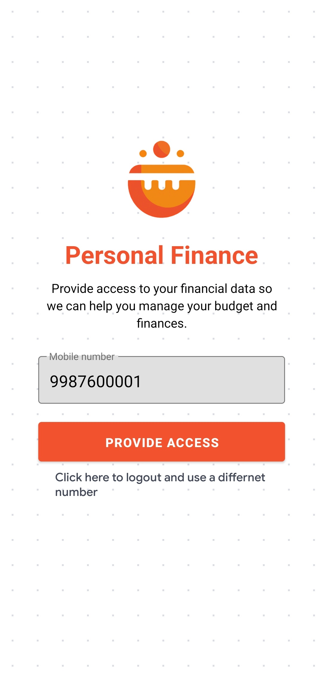
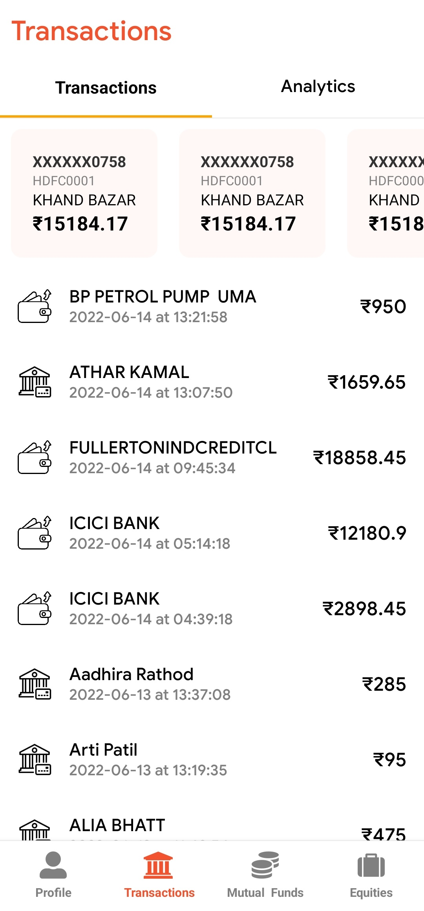
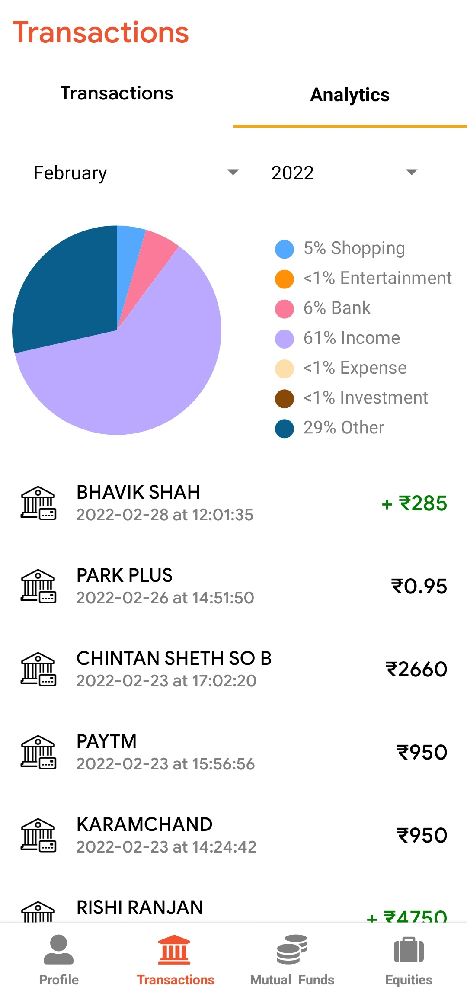

# 𝗗𝗵𝗮𝗻𝗮𝗺v1.0.3 - Manage Your Wealth and Investments Seamlessly

<table style="border:none;">
  <tr>
    <td></td>
    <td></td>
    <td></td>
  </tr>
</table>

Welcome to 𝗗𝗵𝗮𝗻𝗮𝗺, the ultimate fintech solution for managing your wealth and investments. Our app is built using the Account Aggregator API, making it easy for you to track personal expenses, view recent transactions, manage mutual funds, and manage equities all in one place. 

With 𝗗𝗵𝗮𝗻𝗮𝗺, you can have complete control over your financial portfolio with the ability to view your account balances, transactions, and investments in real-time. Our app is built with React Native, making it easy to use and navigate on both iOS and Android devices.

###Features
- Track personal expenses and view recent transactions
- Manage mutual funds and equities
- Real-time account balances and transaction updates
- Built with React Native for use on both iOS and Android devices
- Use of Account Aggregator API for secure and easy access to financial data

### How to use

1. Download the 𝗗𝗵𝗮𝗻𝗮𝗺 app from [Click to Download](https://drive.google.com/drive/folders/1rQw345Gw7PfhFHAsOUl2N2oATxtVpiyj).
2. Create account and log in to the app.
3. Provide concent in Account Aggregator
4. View your account balances, recent transactions, and investments all in one place.
5. Use the app's various features to manage your financial portfolio.

### Built for a BoB Hackathon
𝗗𝗵𝗮𝗻𝗮𝗺 was built for a hackathon and may contain bugs or unfinished features. Your feedback is important to us in order to improve the app. Please report any issues or suggestions through krish@angris.in 

Thank you for choosing 𝗗𝗵𝗮𝗻𝗮𝗺 as your financial management solution. We are confident that it will provide you with the tools and information you need to make informed decisions about your wealth and investments.

